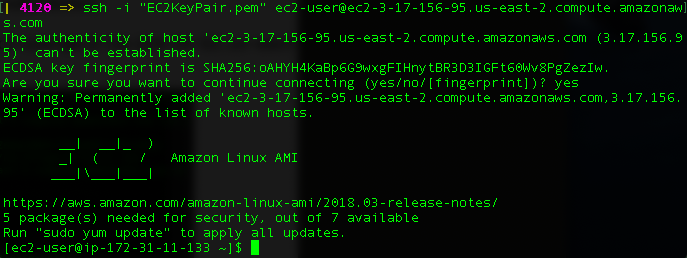

# KafkaServer-Python

Buiding a **[Kafka](https://kafka.apache.org/)** server as a **microservice**, from an automated **containerized** implementation in **[AWS EC2](https://aws.amazon.com/console/)** and use **[Kafka-Python](https://pypi.org/project/kafka-python/)** consumer and producer in few simple steps!

## Kafka
Kafka is an **open source**, distributed, partitioned, fault-tolerant, and a horizontally scalable streaming platform used as a  **real-time publish-subscribe** messaging system. It persists data like a log aggregation and allows applications to push, pull, and process a continuous flow of data in real-time. It also supports strong recovery from failure mechanisms.

 

## Kafka-Python
[Kafka-Python](https://pypi.org/project/kafka-python/) client is a Python implementation of the Apache Kafka distributed stream processing system with [KafkaConsumer](https://kafka-python.readthedocs.io/en/master/apidoc/KafkaConsumer.html) (message consumer API) and [KafkaProducer](https://kafka-python.readthedocs.io/en/master/apidoc/KafkaProducer.html) (asynchronous message producer API) 

## Getting started with the setup

## Step 1 - Create AWS EC2 instance

Launch an EC2 Instance using Ansible Playbook [yml](./aws-ec.yml). 
Requirements - Ansible, Python , Boto and an AWS Account to Launch an EC2 instance.

> **Note:** [Ansible](https://docs.ansible.com) automation engine will be used for [AWS EC2](https://aws.amazon.com/console/) provisioning and application deployment. Install Ansible for Mac (using Homebrew or Python pip Package Manager).

    brew install ansible      
or

    pip3 install ansible  

>  Install Boto with pip, ([Boto](https://boto3.amazonaws.com/v1/documentation/api/latest/index.html) is the Amazon Web Services (AWS) SDK for Python)

    pip3 install boto

>  Create a .boto file with the AWS account credentials in credentials.csv and save with permission 400 -> chmod 400 .boto so that, (U)ser / owner can read, can't write and can't execute

    [Credentials]
    aws_access_key_id = [Access key ID]
    aws_secret_access_key = [Secret access key]

> The deployment playbook - [aws-ec.yml](./aws-ec.yml)

|    key          |    description                |
|---------------- |-------------------------------|
|`'gather_facts'` | gathers facts about remote hosts (boolean)|
|`'key_name'`     | EC2 Console -> NETWORK & SECURITY -> Key pairs|
|`'instance_type'`| t2.micro or t2.small|
|`'image'`        | define an Amazon Machine Image (AMI)|
|`'group'`        | define a security Group, EC2 Console -> NETWORK & SECURITY -> Security Groups|
|`'count'`        | number of instances to launch|
|`'vpc_subnet_id'`| From VPC - Select a Subnet ID in the Availability Zone|
|`'wait'`         | playbook to wait for the instance to be launched and assign a public IP|

Run the playbook - 

    ansible-playbook aws-ec.yml
    

## Step 2 Configure Docker

AWS EC2 instance is running now. SSH to the newly created AWS instance

    ssh -i "EC2KeyPair.pem" ec2-user@ec2-3-17-156-95.us-east-2.compute.amazonaws.com

Update the installed packages and package cache and then install [docker] (https://docs.docker.com/get-docker/)	engine in EC2 instance

    sudo yum update -y
    sudo yum install docker
    sudo service docker start  
    sudo usermod -a -G docker ec2-user
    
Here adding the ec2-user to the docker group to execute docker commands without using sudo, then close the current terminal and log back in a new SSH session

Download the current release of docker compose and apply executable permissions to the binary

    sudo curl -L "https://github.com/docker/compose/releases/download/1.26.0/docker-compose-$(uname -s)-$(uname -m)" -o /usr/local/bin/docker-compose
    sudo chmod +x /usr/local/bin/docker-compose

## Step 2 - Configure Kafka Container

Create a [docker-compose](./docker-compose.yml) by pulling the Apache Kafka docker image to run [Kafka](https://hub.docker.com/r/wurstmeister/kafka/) and [ZooKeeper](https://hub.docker.com/r/wurstmeister/zookeeper/)

|    environment variables      | description                    |
|-------------------------------|-------------------------------|
|`'container_name'`             | name of the docker containers for zookeeper and kafka|
|`'image'`                      | pull zookeeper and kafka images from docker hub|
|`'ports'`                      | zookeeper port 2181, kafka port 9092|
|`'KAFKA_ADVERTISED_HOST_NAME'` | explicitly define the public IP of the running AWS EC2 instance|
|`'KAFKA_ADVERTISED_PORT'`      | kafka port 9092|
|`'KAFKA_ZOOKEEPER_CONNECT'`    | explicitly define the zookeeper node on port 2181|
|`'KAFKA_CREATE_TOPICS'`        | create topics during the build, example Topic1 will have 1 partition and 1 replica|

Start a cluster

    docker-compose up -d
or
    
    docker-compose -f docker-compose.yml up -d

> Note - Stop a cluster
     
     docker-compose stop

> Note - Add more brokers

    docker-compose scale kafka=3

List the topic

    docker-compose exec kafka /opt/kafka/bin/kafka-topics.sh --list --zookeeper zookeeper:2181

create a new topic

    docker-compose exec kafka /opt/kafka/bin/kafka-topics.sh --create --zookeeper zookeeper:2181 --replication-factor 1 --partitions 1 --topic Topic3

pip3 install kafka-python
